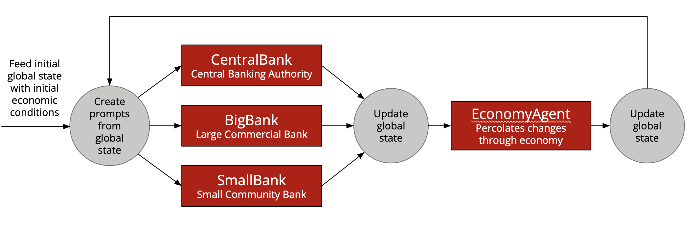

# Agentomics

## Simulating Macroeconomic Dynamics with Intelligent Agents

Macroeconomic systems are intricate, driven by the interactions of financial institutions, policy decisions, and market forces. *Agentomics* takes a hands-on approach to modeling these dynamics using artificial intelligence, agent-based systems, and economic principles. This project demonstrates how developers can leverage the `langroid` framework to build intelligent, agentic systems for simulating and analyzing complex economic scenarios.

## Project Overview

The Agentomics project creates a simulation environment that models interactions among four LLM-powered agents:

1. **SmallBank**: Represents community-focused financial institutions that primarily serve local populations. These agents simulate behaviors like lending, borrowing, and responding to localized economic conditions, emphasizing their grassroots influence on the broader economy.

2. **BigBank**: Acts as a representative large commercial bank with national/international reach. They simulate behaviors such as adjusting reserve requirements, managing large-scale lending operations, and interacting with central regulatory policies, showcasing their significant influence on macroeconomic trends.

3. **CentralBank**: Representative amalgamation of regulatory authorities responsible for overseeing monetary policy and maintaining economic stability. It manages high-level actions like adjusting interest rates, implementing quantitative easing, and responding to economic shifts to guide the simulated economy toward stability.

4. **EconomyAgent**: Serves as the central orchestrator of the simulation. By analyzing inputs and feedback from all agents, EconomyAgent ensures the simulation remains cohesive and reflective of real-world dynamics.

Each of these agents is powered by LLMs and leverages custom tools to make decisions, respond to economic inputs, and influence the simulated macroeconomic environment.

## Key Features of Agentomics

### Agent-Based Architecture

Agentomics utilizes intelligent agents designed using the `langroid` framework. This architecture enables each agent to:

- **Process Economic Inputs**: Agents analyze economic conditions and other agents' behaviors to inform decision-making.
- **Adjust Economic Variables**: Each agent controls specific parameters ("knobs") that influence their behavior and the overall economy.
- **Simulate Interactions**: Agents interact dynamically, creating realistic simulations of economic phenomena.

### Using `langroid` to Build Agentic Systems

Agentomics showcases how developers can utilize the `langroid` framework to create sophisticated agents. Here are the core steps:

1. **Defining Agents**:
   - Use the `ChatAgent` base class from `langroid` to design specialized agents.
   - Customize agent behavior by overriding methods such as `handle_message` or defining specific tools.

2. **Configuring Models**:
   - Select and configure LLMs using `langroid.language_models`. For instance, use `OpenAIGPTConfig` to integrate GPT-based models for reasoning and decision-making.

3. **Integrating Tools**:
   - Develop tools to adjust agent-specific parameters (e.g., economic "knobs") by extending the `langroid.Tool` class.
   - Enable agents to communicate with these tools via structured inputs and outputs.

4. **Simulating Interactions**:
   - Use `langroid`'s messaging framework to manage dynamic exchanges between agents.
   - Track agent decisions and their impacts using shared data structures.

### Role of LLMs

Large language models are at the heart of Agentomics. They provide the agents with advanced reasoning capabilities, enabling them to:

- Interpret complex economic data.
- Simulate decision-making processes based on historical and theoretical frameworks.
- Communicate effectively within the simulation.

### Tools for Economic Control

Each agent type integrates with specialized tools to manage its parameters. These tools are designed to allow `langroid` to automate the parsing

## Implementation Details

The project is implemented in Python, leveraging modular design principles. Here’s a breakdown of the main components:

### Core Agents

1. **EconomyAgent**: A central orchestrator that manages interactions between the various agents and tracks global economic variables.
2. **BigBank**: Represents large-scale commercial banks with significant influence over macroeconomic trends.
3. **CentralBank**: Models the central banking authority, managing monetary policy and responding to economic shifts.

### Tools and Data Structures

The simulation relies on a robust set of tools and data structures, including:

- **Knobs Tools**: Enable agents to adjust economic parameters dynamically.
- **Global State Management**: Tracks the state of the simulation, including economic indicators and agent behaviors.

### Modular Design

The modular approach ensures that each component—from agents to tools—is extensible and reusable. This design fosters scalability, allowing additional agents or economic variables to be integrated seamlessly.

## Applications and Future Directions

Agentomics has exciting applications in research, education, and policy development. Potential use cases include:

- **Economic Research**: Simulating scenarios to study the impact of policy decisions on financial stability.
- **Educational Tools**: Providing interactive learning experiences for students of economics and finance.
- **Policy Testing**: Allowing policymakers to experiment with interventions in a risk-free virtual environment.

Future enhancements could include incorporating machine learning to refine agent decision-making or expanding the range of economic variables modeled in the simulation.

## Conclusion

Agentomics represents a new approach in understanding macroeconomic systems. By combining LLMs, agent-based modeling, and economic theory, it provides a new tool for exploring the complexities of financial systems. Whether you’re an economist, technologist, or curious learner, Agentomics offers a new perspective for economic simulation.
